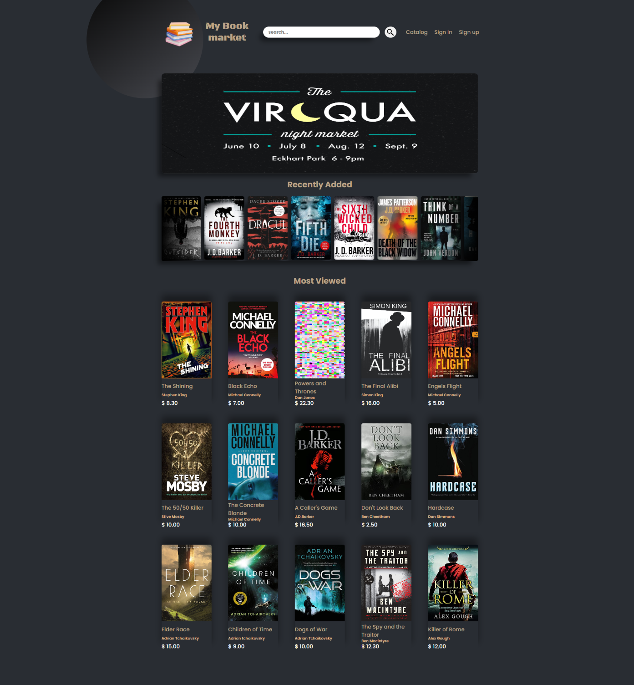

# Project Description

Market about new or used books. Every registered user has the opportunity to add books in his own private library and sell them or choose books from catalog and store them in his cart and order them whenever he wants. Also, he can comment and share his impression of the book or author.

You can sign in with user profile:[ `username`: Peter , `password`:12345] or create your own profile.

### App Link - [Book Market](https://booksmarket.netlify.app/)

## P.S.
Initial server response causes a delay of up to `30` seconds.
Тhe project is still under development. 

## To open the project

### `First`
Open the project directory in your IDE.

### `Second`
In terminal type:
  1. "npm install".
  2. After the previous operation is done - "npm start".

